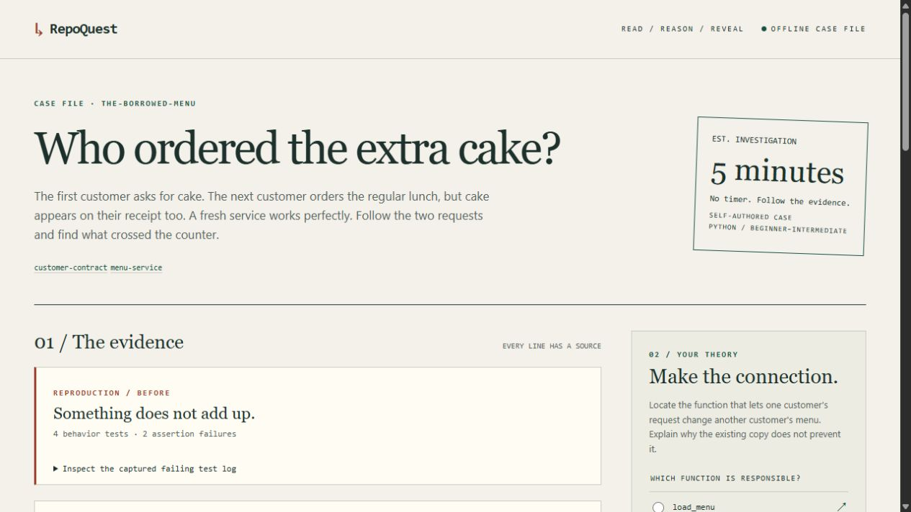

# RepoQuest

**A bug is a story. Find the missing link.**

Turn a fixed Python bug into a five-minute debugging mystery: inspect the evidence, name the responsible function, follow a hint if needed, then reveal the exact patch and its passing tests.

RepoQuest is an installable Agent Skill with a small, standard-library Python CLI. It produces one offline HTML file. No account, server, package installation, or network connection is needed to play.



## Play the first case

Download or clone this repository and open **[demo/index.html](demo/index.html)** in a modern browser. On GitHub, download the HTML first; the repository file viewer does not run it.

**Who ordered the extra cake?** A customer's special order appears on the next customer's receipt. Follow the requests, inspect the code, and find what crossed the counter.

This is an original, clearly labeled teaching fixture, not a historical third-party incident. Its defect is executable: the same four behavior tests produce **two assertion failures before the fix and four passes after it**. The captured [verification record](examples/borrowed-menu/verification.json) binds the exact source, contract, manifest, and license bytes.

## Run it locally

Requires Python 3.10+. The portable script has **no third-party dependencies**. Run these commands from this repository:

```sh
python skills/repoquest/scripts/quest.py check examples/borrowed-menu/case.json
python skills/repoquest/scripts/quest.py verify examples/borrowed-menu/case.json --trust-code
python skills/repoquest/scripts/quest.py build examples/borrowed-menu/case.json --output demo/index.html
```

The included fixture is small enough to inspect before executing. `check` and `build` never execute case code. `verify` executes both snapshots and the shared contract locally; `--trust-code` acknowledges that execution. It is **not a security sandbox**.

For an optional CLI installation inside your own virtual environment:

```sh
python -m pip install .
repoquest --help
```

The package contains the same renderer and CLI as the portable skill. No package has been published to a registry.

## Install the skill in Codex

Copy the **entire** `skills/repoquest` directory into a target project's `.agents/skills/` directory. Keep `SKILL.md`, `scripts/`, `references/`, and `agents/` together.

PowerShell, from this repository:

```powershell
$target = 'C:\path\to\your-project\.agents\skills'
New-Item -ItemType Directory -Force -Path $target | Out-Null
Copy-Item -Recurse -LiteralPath .\skills\repoquest -Destination $target
```

Use a destination without an existing `repoquest` skill; review an existing installation before replacing it. Start a fresh Codex task in that project and invoke:

```text
Use $repoquest to turn this fixed Python bug into a debugging quest.
Use the before and after snapshots in <case-directory> and preserve their provenance.
```

The [skill entry point](skills/repoquest/SKILL.md) tells the agent how to select evidence, curate hints, run the verifier, and check the resulting page. Current host verification is recorded in [docs/verification.md](docs/verification.md). Other skill hosts have not been validated.

## Make another case

Copy `examples/borrowed-menu` to a new local directory. Replace the before/after Python files and common `unittest` contract. Update the title, source attribution, line ranges, candidate functions, hints, and root-cause explanation in `case.json`. Then run `check`, `verify`, and `build` against the new manifest. The previous verification record is rejected as soon as an input changes.

To import a real pair of local Git commits without checking them out or running their code:

```sh
python skills/repoquest/scripts/quest.py import-git /path/to/repo --before PARENT_SHA --after FIX_SHA --file package/module.py --file package/__init__.py --contract /path/to/contract.py --license-file LICENSE --license-name MIT --origin "Project name, source URL, and case attribution" --output /path/to/new-case
```

The importer preserves selected regular Git blobs, full commit IDs, and license text from both revisions. It creates an intentionally incomplete manifest. Curate its narrative and line citations before verification. Include every local import required by the selected code. See the complete [case format](skills/repoquest/references/case-format.md).

## What the first version guarantees

- The verifier requires actual assertion failures before the fix and a passing, nonempty suite after it, with matching test IDs. Import errors, skips, and timeouts cannot count as a reproduced bug.
- Evidence excerpts come from specific fixture paths and line ranges. Changed inputs invalidate the verification record.
- Hints appear sequentially. A confirmation step protects the patch reveal. Native controls support keyboard use, and the page adapts to narrow screens.
- Generated pages escape case text, make no network requests, and contain their code, logs, styling, and interaction script in one file.

These checks validate a curated reproduction, not a universal root-cause claim. Authors still need to review the narrative, licensing, and completeness of their contract. Reports are not signed attestations. The answer is embedded in the HTML and can be found by inspecting its source; this is a learning game, not an anti-cheating system. Scratchpad notes are neither transmitted nor persisted.

The first version supports small Python cases using the standard library. It does not install case dependencies, mine arbitrary repository history, run remote code, or promise measured learning or productivity improvements. Unknown code belongs in a separately managed disposable environment; the timeout is not a process-tree or resource sandbox.

## Maintain and verify

```sh
python -m unittest discover -s tests -v
```

Tests exercise the real before/after path, local Git commit import, execution consent, stale evidence, invalid citations, failure classification, timeout handling, and escaping. See [verification scope](docs/verification.md) for the observed environment and browser checks. To refresh the committed demo after changing case inputs, run `verify` followed by `build`.

Related work: [codebase-to-course](https://github.com/zarazhangrui/codebase-to-course) turns repositories into interactive courses. RepoQuest focuses on one reproducible failure, cited reasoning, and a verified patch reveal. Its implementation and skill text are original.

Licensed under [MIT](LICENSE). Imported cases retain their original notices and may have different redistribution terms.
